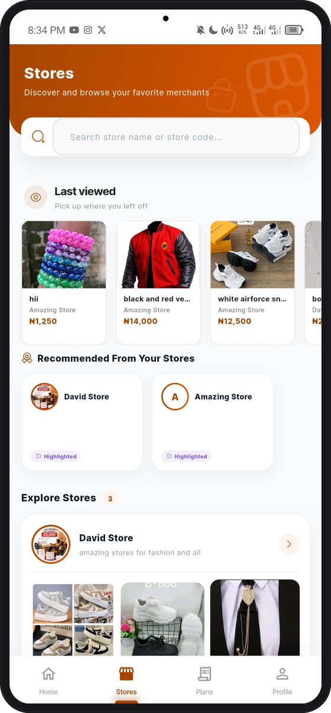
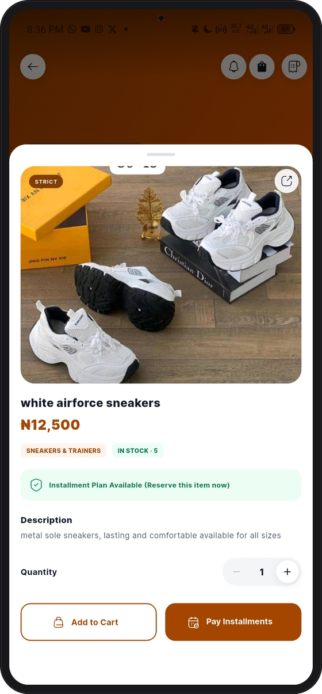
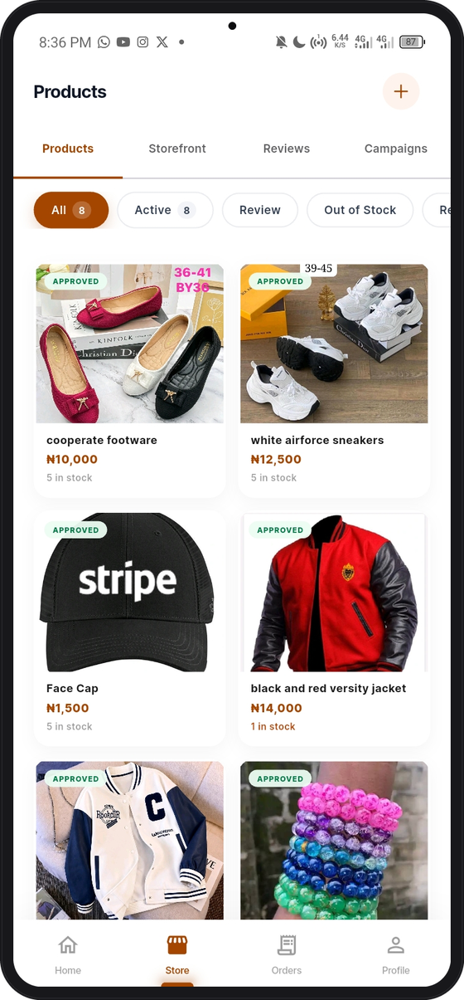

# Korra

**A two-sided buy-now-pay-later marketplace for Nigerian commerce, built in Flutter and backed by a custom underwriting engine.**

Korra lets shoppers reserve an item from a merchant, pay a risk-adjusted down payment, and settle the balance in instalments. Merchants list products, receive reservations, fulfil orders, and get paid on a T+1 settlement cycle. Both sides ship from a single Flutter codebase as two separately-branded apps.

> *Reserve now, pay in parts, own with ease.*

## Live applications

- [Korra Shop on Google Play](https://play.google.com/store/apps/details?id=com.korra.shop.live), the customer application
- [Korra Biz on Google Play](https://play.google.com/store/apps/details?id=com.korra.business.live), the merchant application

<p align="center">
  
  
  
  
</p>

<p align="center">
  <sub>Customer discovery &nbsp;·&nbsp; Product detail &nbsp;·&nbsp; Merchant catalogue &nbsp;·&nbsp; Merchant storefront</sub>
</p>

---

## Table of contents

- [Live applications](#live-applications)
- [What it does](#what-it-does)
- [Engineering highlights](#engineering-highlights)
- [Architecture](#architecture)
- [Tech stack](#tech-stack)
- [Project structure](#project-structure)
- [Running locally](#running-locally)
- [Project scale](#project-scale)

---

## What it does

**The core loop**

1. A merchant lists a product and receives a shareable product code (`K-XXXX-XXXXXXX`) and storefront link.
2. A customer opens the link via deep link, QR code, or the in-app marketplace, and the risk engine computes a minimum down payment for that specific customer and item.
3. The customer pays the down payment, a plan is created, and the merchant sees the reservation instantly.
4. The customer pays instalments on schedule, the merchant is settled T+1, and the item is delivered.

**Customer app.** Marketplace discovery, storefront browsing, KYC (BVN and NIN), instalment plan creation and tracking, in-app payments, dedicated virtual accounts, payment receipts, and push notifications.

**Merchant app (Korra Biz).** Product catalogue management, branded storefront, order and reservation management, outright and layaway sales, payouts with OTP-authorised transfers, campaign broadcasts to followers, and a metrics dashboard that drives marketplace visibility badges.

---

## Engineering highlights

These are the parts of the codebase I would point at in a technical interview.

### Custom risk and underwriting engine

[`lib/logic/korra_risk_engine/`](lib/logic/korra_risk_engine/) is the commercial core of the product. Given a product price, a customer's available credit limit, and their repayment history, it computes a randomised down-payment percentage banded by price tier, calculates the funding gap, and applies hard-stop decline rules when exposure is unfavourable. The client mirrors a server-side implementation deployed as an edge function, which is the sole source of truth: it issues a signed `secureToken` that the checkout flow must present, so a tampered client cannot mint its own terms.

### Dual-flavour single codebase

One Flutter project ships two independently-branded, separately-published apps (customer and merchant) from distinct entry points, `main_customer.dart` and `main_vendor.dart`, resolved through a compile-time flavour config. Web builds get their own per-flavour `index.html` and PWA manifest. This keeps shared models, repositories, theming, and auth in one place while the two products evolve independently.

### Layered BLoC architecture

Strict separation between presentation, logic (BLoC and Cubit), repository, and data source. The UI holds no business logic and never touches Firestore or HTTP directly. Every feature is a state machine with explicit events and states, which makes the payment and KYC flows, where partial failure is expensive, deterministic and testable.

### 40 serverless edge functions

[`supabase/functions/`](supabase/functions/) contains 40 deployable edge functions plus shared server utilities. Money-related, trust-sensitive, and privileged operations run server-side in TypeScript rather than in the client. These operations include payment webhooks and reconciliation, settlement processing, virtual account provisioning, BVN and NIN identity verification, bank account validation, OTP-authorised transfers, product mutations, credit limit recalculation, overdue processing, and scheduled automation for expiry, reminders, and re-engagement.

### Financial correctness under retry

Payment and notification pipelines are written to be idempotent. Reconciliation is keyed off provider references, and fan-out events such as store visits and campaign opens are deduplicated with per-day marker documents written via transactional `create()`, so a retried webhook or a relaunched app cannot inflate counts or double-credit a wallet.

### Production-hardened client

Offline fallbacks with cached data and connectivity monitoring, Crashlytics-instrumented failure paths, forced-update gating via version comparison, image compression before upload, deep link and app-link handling, and local plus remote notification orchestration.

---

## Architecture

```
┌──────────────────────────┐      ┌──────────────────────────┐
│   Korra (Customer)       │      │   Korra Biz (Merchant)   │
│   Flutter · Android/iOS/Web     │   Flutter · Android/iOS/Web
└────────────┬─────────────┘      └────────────┬─────────────┘
             │            one codebase          │
             └────────────────┬─────────────────┘
                              │
            ┌─────────────────▼──────────────────┐
            │  Presentation  →  BLoC / Cubit     │
            │        →  Repository  →  Data      │
            └─────────────────┬──────────────────┘
                              │
        ┌─────────────────────┼─────────────────────┐
        │                     │                     │
┌───────▼────────┐   ┌────────▼─────────┐   ┌───────▼────────┐
│  Firebase      │   │ Supabase Edge    │   │ Payment rails  │
│  Auth          │   │ Functions (40)   │   │ Monnify        │
│  Firestore     │   │ risk · payments  │   │ Paystack       │
│  Storage · FCM │   │ KYC · settlement │   │ webhooks       │
│  Analytics     │   │ automation       │   │ virtual accts  │
└────────────────┘   └──────────────────┘   └────────────────┘
```

**Trust boundary.** The client renders and requests, it never authorises. Credit terms, product mutations, payouts, and settlements are all computed and signed server-side, with Firestore security rules as the second line of defence.

---

## Tech stack

| Layer | Technology |
|---|---|
| Framework | Flutter with Dart SDK ^3.8.1, multi-flavour (Android, iOS, Web) |
| State management | BLoC and Cubit (`flutter_bloc`) with `equatable` |
| Authentication | Firebase Auth, Google Sign-In and email/password |
| Primary datastore | Cloud Firestore |
| Backend | Supabase Edge Functions (Deno, TypeScript) |
| Payments | Monnify SDK and Paystack, virtual accounts, webhooks, settlements |
| Identity and KYC | BVN and NIN verification via edge functions |
| Messaging | Firebase Cloud Messaging with `flutter_local_notifications` |
| Observability | Firebase Analytics and Crashlytics |
| Media | Firebase Storage, `flutter_image_compress`, `cached_network_image` |
| Routing and UI | GetX routing, `flutter_screenutil`, Google Fonts, Lottie |

---

## Project structure

```
lib/
├── bootstrap.dart              # App initialisation (Firebase, dotenv, services)
├── main_customer.dart          # Entry point, customer flavour
├── main_vendor.dart            # Entry point, merchant flavour
├── flavors/                    # Compile-time flavour configuration
├── config/                     # Theme, routes, constants, validators, utils
├── data/
│   ├── models/                 # Domain models (customer, vendor, product)
│   └── repository/             # Data access abstraction over Firestore and APIs
├── logic/
│   ├── bloc/                   # Feature state machines (auth, plans, payouts)
│   ├── cubit/                  # Lightweight state holders
│   ├── core/net/               # Connectivity monitoring
│   ├── services/               # Analytics, notifications, deep links, updates
│   └── korra_risk_engine/      # Underwriting logic, mirrors the edge function
└── presentation/
    ├── auth/                   # Login, signup, verification
    ├── customer/               # Marketplace, storefronts, plans, KYC, profile
    ├── vendor/                 # Dashboard, catalogue, orders, payouts
    └── shared/                 # Cross-flavour widgets

supabase/functions/             # 40 edge functions plus shared server utilities
```

---

## Running locally

**Prerequisites.** Flutter with Dart SDK 3.8.1 or later, a Firebase project, a Supabase project, and your own client-safe configuration.

```bash
# 1. Install dependencies
flutter pub get

# 2. Provide environment configuration
#    Create .env and .env.prod at the project root with client-safe
#    Firebase and Supabase configuration. Keep private keys server-side.

# 3. Run the customer app
flutter run -t lib/main_customer.dart

# 4. Run the merchant app
flutter run -t lib/main_vendor.dart
```

**Release builds**

```bash
flutter build appbundle -t lib/main_customer.dart
flutter build appbundle -t lib/main_vendor.dart
```

Local `.env` files are excluded from Git. They should contain only client-safe configuration because values packaged with a Flutter application can be extracted from a release build. Payment secrets, service-role keys, and other privileged credentials must remain in the server-side environment used by the Supabase Edge Functions.

---

## Project scale

| | |
|---|---|
| Dart source files | 433 |
| Lines of Dart | ~79,000 |
| Serverless edge functions | 40, plus shared server utilities |
| Published apps from one codebase | 2 |
| Platforms | Android, iOS, Web |

---

## Notes

This repository contains the working source for a live product. Sensitive server credentials, local environment files, Firebase client configuration, service-account credentials, and payment provider secret keys are excluded. The project will not run without your own Firebase, Supabase, and client-safe environment configuration.

**Author:** David ([olaniteolanight@gmail.com](mailto:olaniteolanight@gmail.com))
