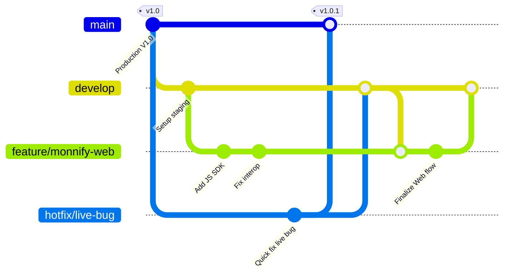

# Professional Git Workflow & Hotfix Guide

This guide details the industry-standard **Git Branching Workflow** (GitHub Flow/Git Flow hybrid) to help you manage code deployments, features, and hotfixes professionally.

---

## 1. Branching Strategy

To keep your production code stable while building new features, use three types of branches:



| Branch Name | Source | Purpose | Always Deployable? |
| :--- | :--- | :--- | :--- |
| `main` (or `master`) | — | Holds **100% stable production code** currently live for customers. | **Yes** (Continuous Delivery) |
| `develop` | `main` | Integration branch where features are combined and tested before release. | **No** (Only to Staging/Test environment) |
| `feature/*` | `develop` | Local branch for building a specific feature (e.g., `feature/monnify-web`). | **No** |
| `hotfix/*` | `main` | Emergency branch to fix a bug in the production app immediately. | **Yes** |

---

## 2. Deploying Your Current Changes (Step-by-Step)

To push the Monnify Web changes we just completed:

### Step A: Check your status
See what files have changed:
```bash
git status
```

### Step B: Create a new feature branch (If you are on `main`)
*If you are already on a feature branch, skip this.*
```bash
git checkout -b feature/monnify-web
```

### Step C: Stage your changes
Add the modified files:
```bash
git add lib/presentation/customer/profile/bank_details_screen.dart
git add lib/presentation/customer/profile/monnify_web_helper.dart
git add lib/presentation/customer/profile/monnify_web_stub.dart
git add lib/presentation/customer/profile/monnify_web_web.dart
git add index.customer.html
git add web/index.html
git add SESSION_HANDOVER.md
```

### Step D: Commit with a professional message
Use descriptive, action-oriented messages:
```bash
git commit -m "feat(payment): integrate Monnify JS SDK overlay for Web platforms"
```

### Step E: Push and Open a Pull Request
Push your branch to GitHub/GitLab:
```bash
git push origin feature/monnify-web
```
*Go to your GitHub repository in your browser and click **"Compare & pull request"** to merge it into `develop` or `main` after review.*

---

## 3. How to Handle a Hotfix (The 3-Week Bug Scenario)

**The Scenario**: You've been working on a feature branch for 3 weeks. A customer reports a bug in the live app. Here is how to fix it without touching or losing your current work-in-progress:

### Step 1: Stash your current work
Save your current uncommitted feature changes in a temporary draft:
```bash
git stash
```

### Step 2: Switch to the stable production branch
```bash
git checkout main
git pull origin main
```

### Step 3: Create a Hotfix branch off production
```bash
git checkout -b hotfix/fix-payment-timeout
```

### Step 4: Fix the bug and test it
Make the code fix in this branch. Run the app, verify it works, then commit the fix:
```bash
git add .
git commit -m "fix(payment): resolve network timeout on checkout screen"
```

### Step 5: Merge the Hotfix into Production (`main`)
1. Switch back to `main`:
   ```bash
   git checkout main
   ```
2. Merge your fix:
   ```bash
   git merge hotfix/fix-payment-timeout
   ```
3. Push `main` to deploy the fix to your customers:
   ```bash
   git push origin main
   ```

### Step 6: Sync the fix back into your Feature Branch
Now you need to make sure your current 3-week feature branch also gets this bug fix, so you don't overwrite it later.
1. Switch back to your feature branch:
   ```bash
   git checkout feature/monnify-web
   ```
2. Merge `main` (which now has the fix) into your branch:
   ```bash
   git merge main
   ```
3. Restore your stashed progress (uncommitted changes) to resume your work:
   ```bash
   git stash pop
   ```

*You are now back to working on your new feature with the live bug completely fixed and integrated!*
